# PostgreSQL


[TOC]


## 1 - Instal·lació PostgreSQL

### 1.1 - Actualització repositoris

- El primer pas serà actualitzar els repositoris de la nostra màquina

```bash
sudo apt-get update
```

.png)


### 1.2 - Instal·lar la paqueteira

- Ara seguidament instal·larem els paquets necessaris per a la pràctica

```bash
sudo apt-get install postgresql postgresql-contrib
```

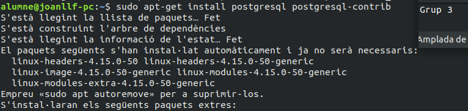

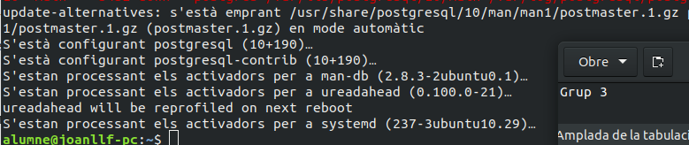


### 1.3 - Configuració

- Per a tots aquells que vulguin revisar els arxius de configuració es troben a:

```bash
cd /etc/postgresql/X.X/main
```

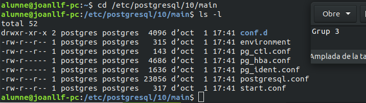


## 2 - Gestio del PostgreSQL

### 2.1 - Posada en marxa del servei

- El primer que farem serà iniciar el servei

```bash
sudo systemctl start postgresql
```

- Seguidament comprovarem l'estat del servei per assegurar el seu correcte funcionament

```bash
sudo systemctl status postgresql
```

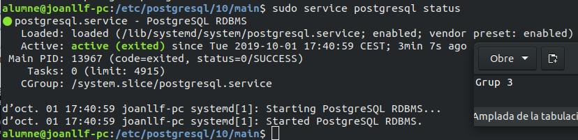


### 2.2 - Gestió bàsica del PostgreSQL

- El primer serà posar una contrasenya a l'usuari postgres

```bash
sudo passwd postgres
```

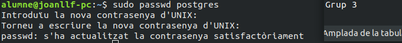


- Seguidament ens loguejarem amb postgres i executarem la BD

```bash
su postgres
psql
```

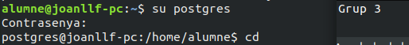

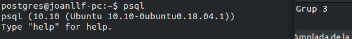


- Una de les comandes més bàsiques i útils és posar contrasenya al nostre usuari postgres

```plsql
ALTER USER postgres WITH PASSWORD ‘contrasenya’;
```

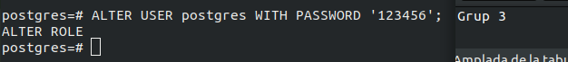


- Generalment no treballarem mai amb el nostre usuari postgres així que millor creem un:

```plsql
CREATE USER usuari WITH PASSWORD ‘contrassenya’;
```


- Per poder utilitzar un usuari necessita permisos suficients i en aquest cas volem un administrador:

```plsql
ALTER USER usuari WITH SUPERUSER;
```


## 3 - Entorn gràfic pgadmin3

### 3.1 - Instal·lació del GUI

- Com qualsevol altre paquet el primer que hem de fer és descarregar-lo, en aquest cas dels repositoris d'ubuntu

```bash
sudo apt install pgadmin3
```

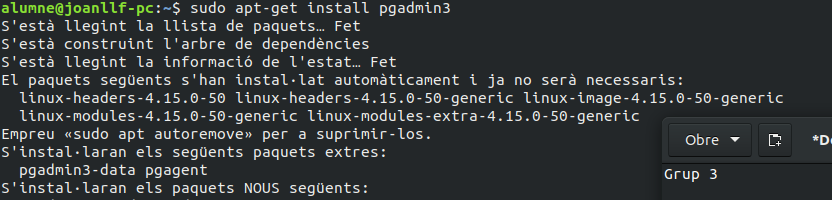

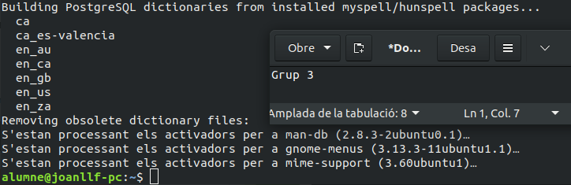


### 3.2 - Execució i configuració

- Ara executarem la GUI i la configurarem per al nostre ús

```bash
pgadmin3
```

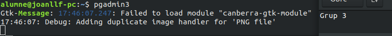

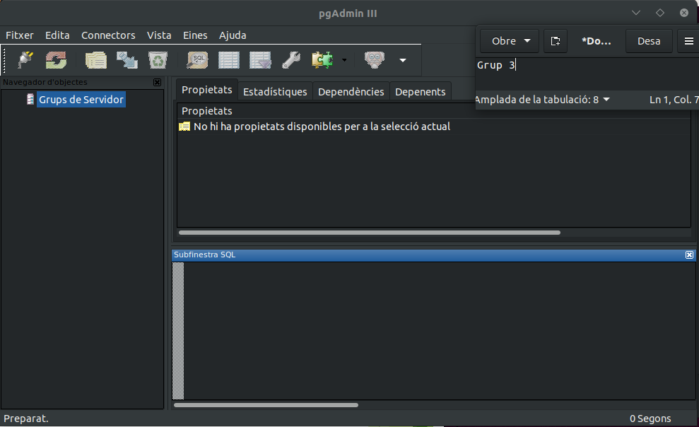


- Seguidament configurarem la connexió per nosaltres

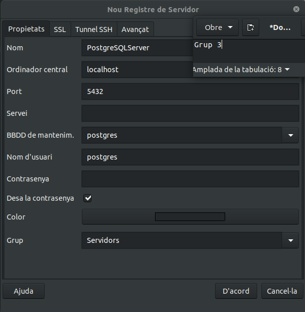


- Finalment ja tenim accés a la BD desde la GUI

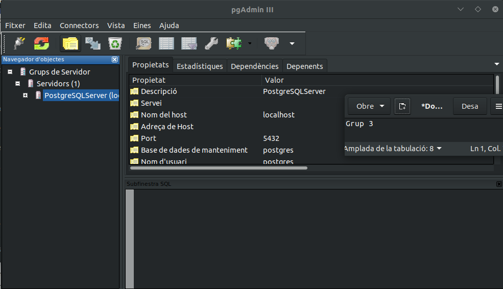

