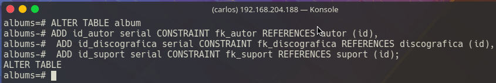
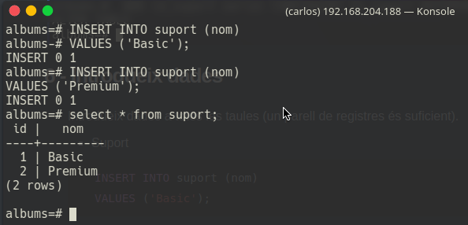
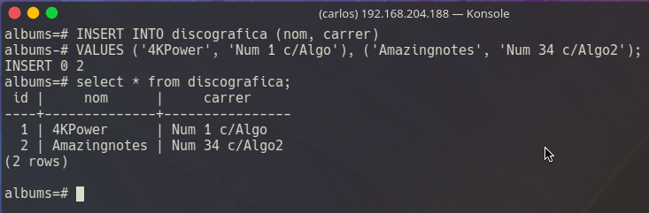
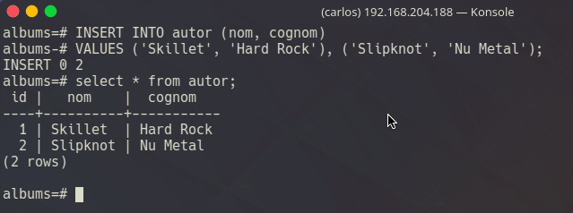
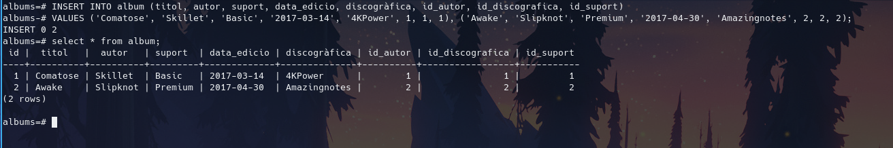

# DAM2_M2_UF4_Pt1.2

[TOC]


## 1 - Crear user albums i BD

- Crea un usuari àlbums i una base de dades amb el mateix nom.

```plsql
CREATE USER albums WITH PASSWORD '123';
```

```plsql
ALTER USER albums WITH SUPERUSER;
```


```plsql
CREATE DATABASE albums;
```


## 2 - Donar password al usuari

- Dóna-li una contrasenya a l’usuari.

```plsql
CREATE USER albums WITH PASSWORD '123';
```


## 3 - Crear taula principal

- Crea la taula principal amb la que poder gestionar la teva col·lecció d’àlbums musicals (ID de tipus serial, titol de tipus varchar, autor de tipus varchar, suport de tipus varchar, data_edicio de tipus date, discogràfica de tipus varchar). Poseu el ID com a clau primària.


> Primer que rés entrarem a la BD correcta amb l'usuari desitjat, **no ho he pogut fer amb l'usuari albums per problemes de seguretat amb el mètode d'autenticació**

```bash
#psql -d databse -U user -W
psql -d albums -U albums -W
```


>
> Aqui ja podem veure com creem i llistem la taula
>

```plsql
CREATE TABLE album (
    id        		serial CONSTRAINT firstkey PRIMARY KEY,
    titol       	varchar(40) NOT NULL,
    autor			varchar(40) NOT NULL,
    suport			varchar(40),
    data_edicio		date,
    discogràfica	varchar(40)
);
```


## 4 - Crear taules complementàries

- Crea les següents taules complementàries (cadascuna en la seua clau primària):
  - autor
  
  ```plsql
  CREATE TABLE autor (
      id        		serial CONSTRAINT firstkeyautor PRIMARY KEY,
      nom       		varchar(40) NOT NULL,
      cognom			varchar(100)
  );
  ```
  
  
  
  
  
  - discogràfica
  
  ```plsql
  CREATE TABLE discografica (
      id        		serial CONSTRAINT firstkeydiscografica PRIMARY KEY,
      nom       		varchar(40) NOT NULL,
      carrer			varchar(200)
  );
  ```
  
  
  
  
  
  - suport
  
  ```plsql
  CREATE TABLE suport (
      id        		serial CONSTRAINT firstkeysuport PRIMARY KEY,
      nom       		varchar(40) NOT NULL
  );
  ```
  
  


## 5 - Crear les claus foranes

- Crea les claus foranes necessàries a la taula principal.

```plsql
ALTER TABLE album
	ADD id_autor serial CONSTRAINT fk_autor REFERENCES autor (id),
	ADD id_discografica serial CONSTRAINT fk_discografica REFERENCES discografica (id),
	ADD id_suport serial CONSTRAINT fk_suport REFERENCES suport (id);
```



## 6 - Introdueix dades

- Introdueix dades a totes les taules (un parell de registres és suficient).

  - Suport

  ```plsql
  INSERT INTO suport (nom)
  	VALUES ('Basic');
  
  INSERT INTO suport (nom)
  	VALUES ('Premium');
  ```

  

  

  - Discogràfica

  ```plsql
  INSERT INTO discografica (nom, carrer)
  VALUES ('4KPower', 'Num 1 c/Algo'), ('Amazingnotes', 'Num 34 c/Algo2');
  ```

  

  

  - Autor

  ```plsql
  INSERT INTO autor (nom, cognom)
  VALUES ('Skillet', 'Hard Rock'), ('Slipknot', 'Nu Metal');
  ```

  

  

  - Album

  ```plsql
  INSERT INTO album (titol, autor, suport, data_edicio, discogràfica, id_autor, id_discografica, id_suport)
  VALUES ('Comatose', 'Skillet', 'Basic', '2017-03-14', '4KPower', 1, 1, 1), ('Awake', 'Slipknot', 'Premium', '2017-04-30', 'Amazingnotes', 2, 2, 2);
```
  




## 7 - Realitzar alguna consulta

- Des de l’eina pgAdmin III realitza alguna consulta dels tipos següents:
  - INNER JOIN 
  - OUTER JOIN (FULL/LEFT/RIGHT)
