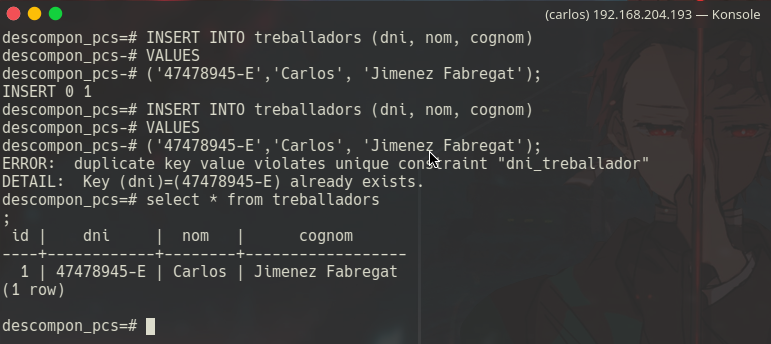

#  M2 UF4 Pt2.1 PostgreSQL Objectes

[TOC]

## 0. Preparació entorn

- Crea la base de dades DESCOMPON_PCS a partir de l'script arxiu.psql seguint les instruccions indicades al peu del mateix.

  

  > ​	El primer pas serà la creació de la BD amb el nom desitjat:

```plsql
CREATE DATABASE DESCOMPON_PCS;
```


> Seguidament imporarem l'arxiu sql per emplenar la BD amb totes les comandes desitjades:

```bash
psql -d descompon_pcs -a -f arxiu.psql
```


## 1. Crear un camp compost

- Crea un tipo de dades compost  que inclogue més d'un camp (`CREATE TYPE ... AS ...`) que pugue servir per una columna d'una nova taula que hauràs de crear a la BD (no es pot usar el tipo de l'exemple dels apunts). 

> Per crear un camp compost ho farem de la següent manera, la taula tindrà la següent estructura:
>
> Empresa:
>
> - id
>
> - Nom
> - Adreca
> - Localitzacio
> - Representant [ ]

```plsql
CREATE TYPE portaveu AS
( 
	nom VARCHAR(50),
	cognom VARCHAR(50),
	dni VARCHAR(10)
);
```


## 2. Crear taula amb camp compost

- Crea una nova taula que inclogue algun camp del tipo de dades compost anterior.

> Avans hem esmentat com seria la taula, ara només cal crear-la de forma que inclogui el camp compost:

```plsql
CREATE TABLE empreses
(
id SERIAL NOT NULL PRIMARY KEY,
nom varchar(50),
adreca varchar(100),
localitzacio varchar(100),
representant portaveu
);
```


## 3. Inserts a una taula amb camp compost

- Mostra exemples d'inserció de dades a la taula (INSERT INTO...), actualització i consulta de les mateixes (SELECT...), accedint en tots els casos al camp del tipo de dades compost.

> qawrtgasrgargerg

```plsql
INSERT INTO empreses (nom, adreca, localitzacio, representant) 
VALUES 
('PCComponentes', 'c/Algun lloc de almeria', 'Espanya',
ROW
('Carlos', 'Jimenez Fabregat', '47478945-E')
);
```


## 4. Restriccions als camps

- Afegiu a alguna taula ja creada, o creeu-ne alguna de nova, que tingue diferents tipos de restriccions (`PRIMARY KEY, UNIQUE, FOREIGN KEY/REFERENCES, NULL, CHECK, ...`) als atributs. Demostreu la utilitat de les restriccions insertant dades a les taules.

> Jo he triat demostarar el tipus `UNIQUE` que és molt útil per a tipus de camps que volem que actuen com una clau primaria a nivell de que no es poden repetir i han de ser unics per exemple un DNI

```plsql
CREATE TABLE treballadors
(
id SERIAL NOT NULL PRIMARY KEY,
dni varchar(10),
nom varchar(50),
cognom varchar(100)
);
```

```plsql
ALTER TABLE treballadors ADD CONSTRAINT dni_treballador UNIQUE (dni);
```


> Ara només caldrà realitzar les pertinents comprovacions

```plsql
INSERT INTO treballadors (dni, nom, cognom) 
VALUES 
('47478945-E','Carlos', 'Jimenez Fabregat');
```

- Com podem veure al intentar inserir dos treballadors amb el mateix DNI  ens diu que no poden haver-hi duplicats




## 5. Restriccions a les taules

- Feu el mateix que al punt 4 però en restriccions de taula. 

> Ara simplement caldrà crear la taula nova directament amb els camps dels que volm fer el unique

```plsql
CREATE TABLE treballadors
(
id SERIAL NOT NULL PRIMARY KEY,
dni varchar(10),
nom varchar(50),
cognom varchar(100),
CONSTRAINT pk_treballadors2 PRIMARY KEY(id),
CONSTRAINT id_dni_treballadors2 UNIQUE(id, dni)
);
```

