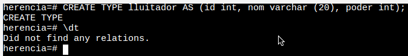
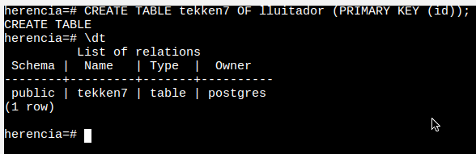
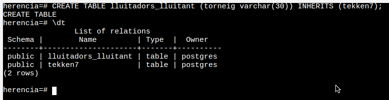
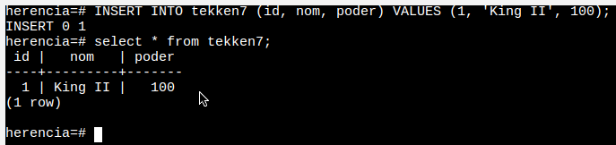
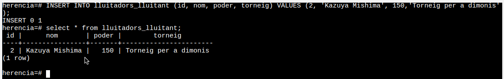
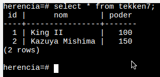

# M2 UF4 Pt2.2 PostgreSQL Tipus objecte - Herència


[TOC]


## 1 - Crear la base de dades

- El primer que farem serà crear una BD nova per a fer les proves pertinents i així tenir-ho tot més ordenat

```plsql
CREATE DATABASE herencia;
```


- El proxim pas serà canviar a la nova BD per poder treballar sobre la mateixa

```plsql
\c herencia
```


## 2 - Creació del type

- En aquest punt la nostra intenció serà crear l'`objecte` 'type'. En el meu cas he escoillit un de senzill, l'objecte lluitador

```plsql
CREATE TYPE lluitador AS (id int, nom varchar (20), poder int);
```




## 3 - Creació de la taula d'objectes

- Un cop creat el type el nostre proxim objectiu serà crear una taula amb els types anterirors com a camp

```plsql
CREATE TABLE tekken7 OF lluitador (PRIMARY KEY (id));
```




## 4 - Creació de la taula heredera

- Per últim si volem crear una taula on només tindrem alguns dels objectes de la taula anteriror per motius X pero no volem fer tots els camps nomes cal 'heredar-la'

```plsql
CREATE TABLE lluitadors_lluitant (torneig varchar(30)) INHERITS (tekken7);
```




## 5 - Inserts

- Ara tenim l'estructura bàsica però no hi han dades anem a inserir-ne unes quantes en diferents casos

> **Lluitador sense torneig**

```plsql
INSERT INTO tekken7 (id, nom, poder) VALUES (1, 'King II', 100);
```




> **Lluitador amb torneig**, de forma automàtica també s'afegirà al lluitador a la taula prèvia, **tekken7**

```plsql
INSERT INTO lluitadors_lluitant (id, nom, poder, torneig) VALUES (2, 'Kazuya Mishima', 150,'Torneig per a dimonis');
```



