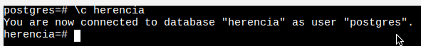

# Tipus objecte - OIDs - Herència

[TOC]

## 0 - Estat actual

- Treballarem en la base de dades DESCOMPON_PCS creada a l'anterior pràctica.

  > Comprovarem el nostre estat anterior ja que fa molt de temps que no toquem PostgreSQL


```plsql
\l
```


```plsql
\dt
```




## 1 - 