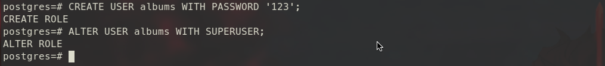
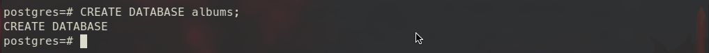
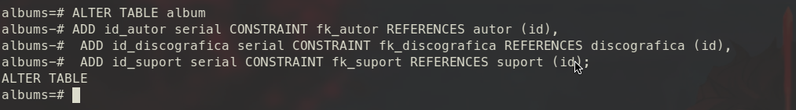

# Primers pasos amb Docker


[TOC]


## 1 - Instal·lar docker


- El primer serà realitzar un update del repositoris del sistema

```bash
sudo apt update
```


- Seguidament desinstal·larem les versions antigues de **Docker**

```bash
sudo apt remove docker docker-engine docker.io
```


- Finalment només caldrà instal·lar el software

```bash
sudo apt install docker docker.io
```


## 2 - Baixar el contenidor


- Seguidament el que farem serà baixar el contenidor a la màquina per fer-lo servir en Docker

```bash
sudo docker pull postgres
```


- Ara comprovarem que realment tenim el contenedor baixat

```bash
sudo docker image ls
```


## 3 - Iniciem el contenidor


- Ara realitzarem l'acció més important, iniciar el contenidor per al seu ús indicant "username", "password" i "database"

```bash
sudo docker run --name username -e POSTGRES_PASSWORD=password -d database
```


- I per ultim només caldra accedir al servei del nostre contenidor amb les credencials inidicades al pas anterior 

```bash
sudo docker run -it --rm --link username:postgres database psql -h postgres -U postgres
```


## 4 - Repetir pràctica 1.2


### 4.1 - Crear user albums i BD

- Crea un usuari àlbums i una base de dades amb el mateix nom.

```plsql
CREATE USER albums WITH PASSWORD '123';
```

```plsql
ALTER USER albums WITH SUPERUSER;
```




```plsql
CREATE DATABASE albums;
```




### 4.2 - Donar password al usuari

- Dóna-li una contrasenya a l’usuari.

```plsql
CREATE USER albums WITH PASSWORD '123';
```


### 4.3 - Crear taula principal

- Crea la taula principal amb la que poder gestionar la teva col·lecció d’àlbums musicals (ID de tipus serial, titol de tipus varchar, autor de tipus varchar, suport de tipus varchar, data_edicio de tipus date, discogràfica de tipus varchar). Poseu el ID com a clau primària.

> Primer que rés entrarem a la BD correcta amb l'usuari desitjat

```bash
sudo docker run -it --rm --link carlos:postgres postgres psql -h postgres -U albums
```


> Seguidament canviarem a la BD desitjada

```plsql
\c albums
```


> Ara ja podem començar a crear la taula

```plsql
CREATE TABLE album (
    id        		serial CONSTRAINT firstkey PRIMARY KEY,
    titol       	varchar(40) NOT NULL,
    autor			varchar(40) NOT NULL,
    suport			varchar(40),
    data_edicio		date,
    discogràfica	varchar(40)
);
```


### 4.4 - Crear taules complementàries

- Crea les següents taules complementàries (cadascuna en la seua clau primària):

  - autor

    ```plsql
    CREATE TABLE autor (
        id        		serial CONSTRAINT firstkeyautor PRIMARY KEY,
        nom       		varchar(40) NOT NULL,
        cognom			varchar(100)
    );
    ```

    

  - discogràfica

    ```plsql
    CREATE TABLE discografica (
        id        		serial CONSTRAINT firstkeydiscografica PRIMARY KEY,
        nom       		varchar(40) NOT NULL,
        carrer			varchar(200)
    );
    ```

    

  - suport

    ```plsql
    CREATE TABLE suport (
        id        		serial CONSTRAINT firstkeysuport PRIMARY KEY,
        nom       		varchar(40) NOT NULL
    );
    ```


### 4.5 - Crear les claus foranes

- Crea les claus foranes necessàries a la taula principal.

```plsql
ALTER TABLE album
	ADD id_autor serial CONSTRAINT fk_autor REFERENCES autor (id),
	ADD id_discografica serial CONSTRAINT fk_discografica REFERENCES discografica (id),
	ADD id_suport serial CONSTRAINT fk_suport REFERENCES suport (id);
```




### 4.6 - Introdueix dades

- Introdueix dades a totes les taules (un parell de registres és suficient).

  - Suport

    ```plsql
    INSERT INTO suport (nom)
    	VALUES ('Basic');
    
    INSERT INTO suport (nom)
    	VALUES ('Premium');
    ```

    

    

  - Discogràfica

    ```plsql
    INSERT INTO discografica (nom, carrer)
    VALUES ('4KPower', 'Num 1 c/Algo'), ('Amazingnotes', 'Num 34 c/Algo2');
    ```

    

    

  - Autor

    ```plsql
    INSERT INTO autor (nom, cognom)
    VALUES ('Skillet', 'Hard Rock'), ('Slipknot', 'Nu Metal');
    ```

    

    

  - Album

    ```plsql
    INSERT INTO album (titol, autor, suport, data_edicio, discogràfica, id_autor, id_discografica, id_suport)
    VALUES ('Comatose', 'Skillet', 'Basic', '2017-03-14', '4KPower', 1, 1, 1), ('Awake', 'Slipknot', 'Premium', '2017-04-30', 'Amazingnotes', 2, 2, 2);
    ```

    

    


