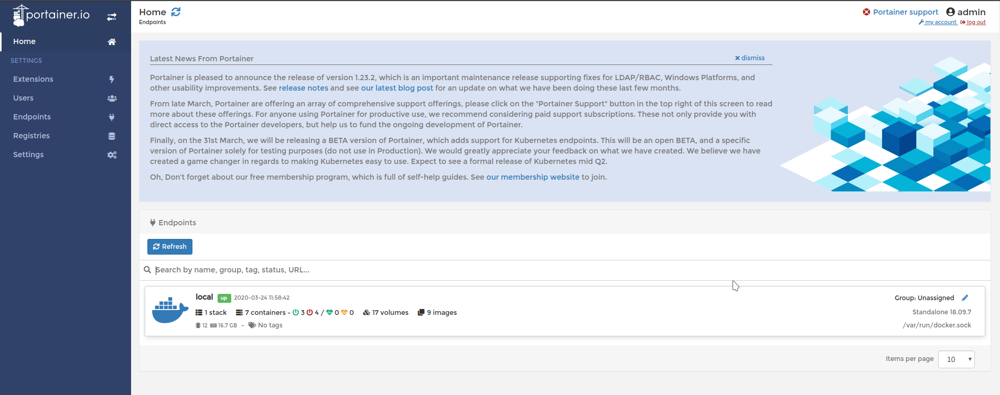

# Interfície Gràfica Pgadmin IV


[TOC]


## 1 - Requisits


### 1.1 - Docker

- El primer requisit serà instal·lar i tenir **docker** en ple funcionament

  

  - Primer eliminem qualsevol antic rastre del mateix

  ```bash
  sudo apt remove docker docker-engine docker.io
  ```

  - Seguidament instal·larem el paquet

  ```bash
  sudo apt install docker.io
  ```

  - Farem que inicie al arrencar la màquina

  ```bash
  sudo systemctl enable docker.service
  ```

  - Afegirem el nostre usuari al grup de docker per no necessitar `sudo`

  ```bash
  sudo usermod -a -G docker $USER
  ```


### 1.2 - Portainer (Opcional però casi obligatori)

- En aquest apartat instal·larem **portainer**, una interficie grafica per administrar **docker** de forma mes adient

  

  - En primera instancia crearem un volum per al portainer

  ```bash
  docker volume create portainer_data
  ```

  - Seguidament la comanda per crear el contenidor de la interficie

  ```bash
  docker run --name portainer --restart=unless-stopped -d -p 8000:8000 -p 9000:9000 -v /var/run/docker.sock:/var/run/docker.sock -v portainer_data:/data portainer/portainer
  ```

  - Finalment les comandes per actualitzar-lo (**nomes funciona al crear el contenidor amb la comanda anterior**)

  ```bash
  docker stop portainer
  ```

  ```bash
  docker pull portainer/portainer
  ```

  ```bash
  docker start portainer
  ```


> Un cop realtizats aquets passos només caldrà entrar a la següent direcció per accedir a la GUI:  [LINK](http://localhost:9000/)
>
> ​	**NOTA:** Caldrà crear un usuari admin per a la GUI, ho fas el primer cop que visites la GUI al link donat, de la 	mateixa manera caldra especificar que treballem en local


### 1.3 - PostgreSQL

- Evidentment necessitem un **PostgreSQL** per poder treballar amb ell amb **PGAdminIV** anem a fer-ho amb la GUI mencionada anteriorment

> El primer serà iniciar sessio a la GUI


> Seguidament entrarem a l'apartat per treballar en local




> Escollirem un template de **PostgreSQL** ja creat


> Indiquem el nom que volem per al contenidor, el network el deixem tal com està, indiquem el nom de l'admin i finalment la password del mateix. Per acabar nomes cal premer el boto **Deploy the container**


> Ara al anar a l'apartat de contenidors hauriem de veure el nostre contenidor de **PostgreSQL** funcionant a la llista de contenidors si no només cal seleccionar-lo i premer **start**


### 1.4 - PGAdmin IV

- Un cop ja tenim el **PostgreSQL** funcionant ja només cal la GUI **PgadminIV** per administrar-lo

  

  - El primer que farem serà descarregar la imatge

  ```bash
   docker pull dpage/pgadmin4 
  ```

  - Seguidament crearem el contenidor

  ```
  docker run -p 80:80 \
  -e "PGADMIN_DEFAULT_EMAIL=el_teu@correu.electronic" \
  -e "PGADMIN_DEFAULT_PASSWORD=la_teva_contrasenya" \
  -d dpage/pgadmin4
  ```


- Ara un cop fet això si anem al **Portainer** podrem veure el **PgadminIV** a la llista i si fem click a l'apartat de published ports del contenidor en qüestió ens obrirà el link per accedir-hi


> Hi podem accedir amb el correu i password introduits al crear el contenidor


## 2 - Afegir un servidor

- Ara el que farem serà afegir un servidor nou ho farem amb interficie aixi que, Let's GO!

> Amb un click secundari accedirem al seguent menu


> On ens apareixera el següent diàleg, en aquest moment només indicarem el nom


> Un cop a l'apartat de connexio sí caldrà especificar **IP**, **Port**, **BD per defecte**, **Usuari**, **Password**. 
>
> ​	**NOTA:** Per saber la vostra **IP** de **PStgreSQL** us la dona el **Portainer**


## 3 - Visualització, inserts etc.

- Per problemes tecnincs no he pogut importar la BD **docencia** però sí que puc fer inserts i consultes amb les BD ja creades per mi
  - Consulta:

    

  - Modificació:

    - Modifiquem les dades visualitzades a voluntat i premem el botó de desar canvis (posició actual del ratolí)

  

  - Eliminació:
    - Seleccionem el número de fila i premem el botó d'eliminar el registre (posició del ratolí)

  